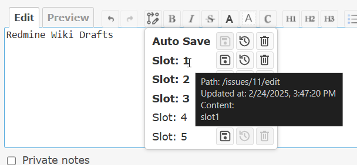

# Redmine Wiki Drafts plugin
This is a Redmine plugin that provides automatic saving and management of multiple wiki drafts. This plugin enables users to preserve in-progress wiki edits with auto-save functionality and manual drafts, all accessible via the jsToolBar.



## Features
- jsToolBar Integration: Adds a "Draft" button  to the jsToolBar that opens a menu for saving , restoring , and deleting  drafts.
- Auto-Save: Automatically saves your wiki edits every 60 seconds by default to a dedicated auto-save slot (slot 0). The auto-save interval can be changed on the plugin settings page.
- Multiple Drafts: Supports multiple manual drafts (slots 1–5 by default) per user. The maximum number of slots can be changed on the plugin settings page.

## Requirements
- Redmine 5.1, Redmine 6.0 (Other versions have not been tested)

## Installation
### 1. Clone or download the plugin into your Redmine plugins directory:

#### When using Git
```bash
cd /path/to/redmine/plugins
git clone https://github.com/sk-ys/redmine_wiki_drafts.git
```

#### When not using Git
1. Download zip file from the [release page](https://github.com/sk-ys/redmine_wiki_drafts/releases) or the [latest main repository](https://github.com/sk-ys/redmine_wiki_drafts/archive/refs/heads/main.zip).
2. Extract the zip file to your Redmine plugin directory. The name of the unzipped directory must be `redmine_wiki_drafts`.

### 2. Run the database migrations:
```bash
bundle exec rake redmine:plugins:migrate RAILS_ENV=production
```
### 3. Restart Redmine

## Uninstallation
### 1. Run the migrations to roll back the database to its initial state:
```bash
bundle exec rake redmine:plugins:migrate NAME=redmine_wiki_drafts VERSION=0 RAILS_ENV=production
```

### 2. Remove this plugin directory from the plugins directory

### 3. Restart Redmine

## Icon License
This plugin uses icons provided by Google Fonts (e.g., Material Icons) which are licensed under the Apache License, Version 2.0. For details, please refer to the [Apache License, Version 2.0](https://www.apache.org/licenses/LICENSE-2.0) and the [Google Frequently Asked Questions](https://developers.google.com/fonts/faq).